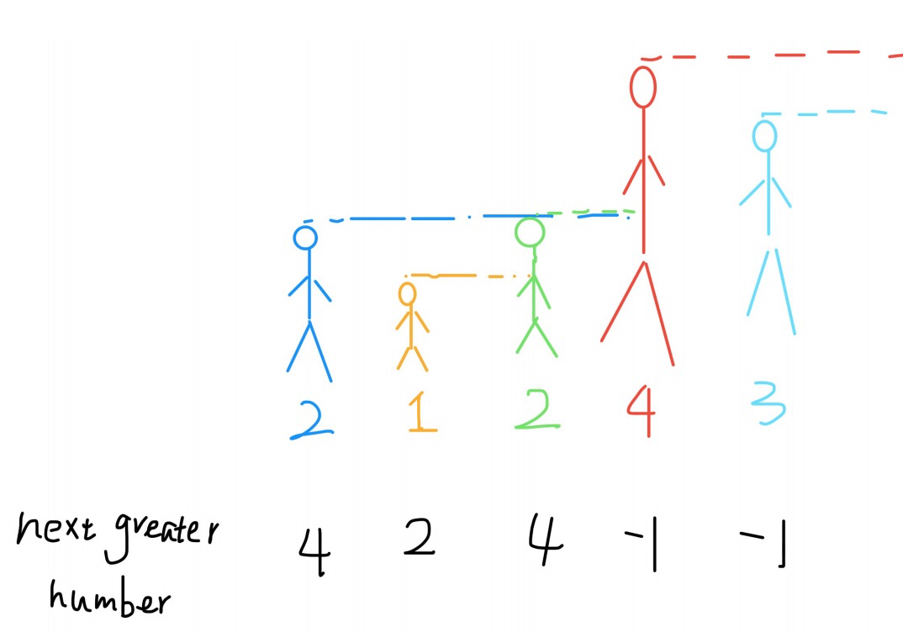

# section1 单调栈.md

# 定义
栈内的元素按照某种方式排序下单调递增或单调递减，如果新入栈的元素破坏的单调性，就弹出栈内元素，直到满足单调性。

# 实战
**例题:**  
给你⼀个数组，返回⼀个等⻓的数组，对应索引存储着下⼀个更⼤元素，如果没有更⼤的元素，就存-1。直接上⼀个例⼦： 给⼀个数组 [2,1,2,4,3]，需要返回数组 [4,2,4,-1,-1]。  
**解释:**  
第⼀个2大的后面的数4; 比1⼤的后面的数是2；第⼆个2后⾯⽐2⼤的数是4; 4后⾯没有⽐4⼤的数，填-1；3后⾯没有⽐3⼤的数，填-1。  
**解答:**
```python
# 单调栈
if __name__ == '__main__':
    case = [2,1,2,4,3]

    stack = []
    results = [-1 for _ in range(len(case))]
    for i in range(len(case)):
        while stack and case[stack[-1]] < case[i]:
            j = stack.pop()
            results[j] = case[i]
        stack.append(i)
    for i in stack:
        results[i] = -1
    print(results)
        
```
**理解:**  

tips：合理的使用哨兵，能有效减少边界的考虑  
**代码框架:**
```python
vals = []
stack = []
for i in range(len(vals)):  # i 表示当前值
    while stack and vals[stack[-1]] < vals[i]:  # 单调减，则 pop
        j = stack.pop()  # 因为单调减，说明 i 是 j 右侧最近的大值；同时也因为单调减，stack 前驱节点一定是后驱节点左侧最近的大值
        """
        一般在这里搞事情；
        """ 
    stack.append(i)
```

# 提单
- [x] 239.滑动窗口最大值
- [x] 739.每日温度
- [x] 84.柱状图中最大的矩形
- [x] 42.接雨水
- [x] 496.下一个更大元素 I
- [x] 316.去除重复字母
- [x] 901.股票价格跨度
- [x] 402.移掉 K 位数字

# 解析
### 239.滑动窗口最大值
> 单调递减栈(栈顶就是最新的值，栈顶 -1 就是最新值前最近的较大的数，栈底就是截止最新值时的整体 max)  
> 注意每次窗口右异时，需要将 start 和栈底比较，如果相等则 pop 栈底；

### 739.每日温度
> 单调递减栈
> 题目要求就是求一个数，右边的第一个较大的值，反转一下，问题转化成求一个数左边最近的较大值，标准的单调递减栈；
> 该题目不是求值，而是求值对应的下标

### 84.柱状图中最大的矩形
1. 做法 1
> 两个单调递减栈，分别找出 i 左边最近较小值，右边最近较小值  
> 能得到 i 对应高度的矩形面积  
> 对所有 i 求 max 即可

2. 做法 2
> 单调增栈+哨兵  
> 每次栈 pop，就说明 pre 值到 i 为止(右边延伸)，同时，pop 之后的栈顶，相当于 pre.pre，相当于 pre 到 pre.pre为止（左边延伸）  
> 这样用 pre 的高度 height ，与右边延伸 i 和左边延伸 pre.pre 距离 weight，二者乘积就是 pre 的延伸面积  
> 哨兵的意思是队列两边都添加 0，能避免很多边界的判断  

### 42.接雨水
> 单调减栈
> 找洼地计算面积

### 496.下一个更大元素 I
> 单调减栈

### 316.去除重复字母
> 单调增栈，两个 map，分别记录是否已入栈以及使用次数

### 901.股票价格跨度
> 单调减栈

### 402.移掉 K 位数字
> 单调增栈